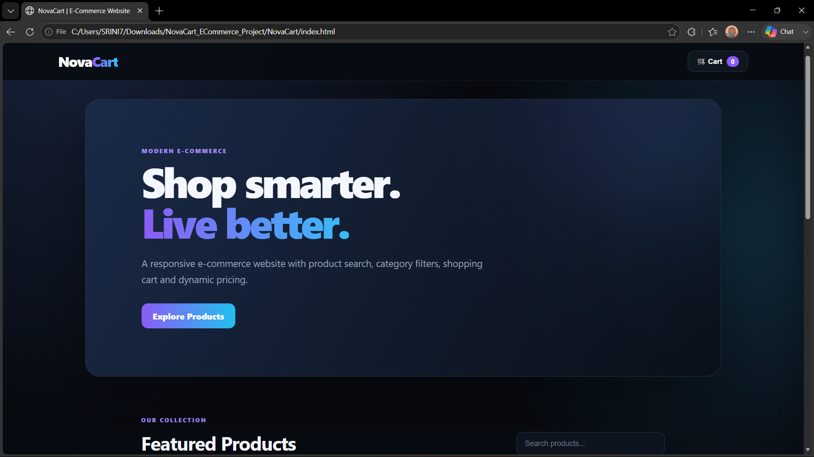

# 🛒 NovaCart — Modern E-Commerce Website

<p align="center">
  A modern, responsive and interactive front-end e-commerce website built with HTML5, CSS3 and JavaScript.
</p>

<p align="center">
  <strong>Search • Filter • Cart • LocalStorage • Responsive UI • Demo Checkout</strong>
</p>

---

## 📌 About The Project

**NovaCart** is a modern e-commerce website created to demonstrate practical front-end development skills.

The project provides a realistic shopping experience with product discovery, category filtering, a dynamic shopping cart, persistent cart data using LocalStorage, responsive layouts, product illustrations and a demo checkout flow.

The interface uses a premium dark theme with gradients, glowing effects, hover animations and responsive components.

---

## 🖼️ Project Preview



*NovaCart homepage featuring the premium dark-themed hero section, gradient branding, responsive navigation and product search interface.*

---

## ✨ Features

### 🛍️ Product Management
- Product listing with reusable JavaScript product data
- Electronics, Fashion and Accessories categories
- Product image/illustration for every item
- Product name, category, description and price

### 🔍 Search & Filtering
- Real-time product search
- Search by product name
- Search by product description
- Category-based filtering
- "All" category to display the complete collection

### 🛒 Shopping Cart
- Add products to cart
- Increase product quantity
- Remove products from cart
- Automatic cart item count
- Automatic total price calculation
- Responsive cart sidebar
- Empty-cart state

### 💾 LocalStorage
- Cart data is stored using the browser LocalStorage API
- Cart items remain available after refreshing the page
- No backend or database is required

### 🎨 UI / UX
- Premium dark interface
- Purple-to-blue gradient branding
- Glass-style navigation
- Product card hover animations
- Floating hero product visual
- Add-to-cart toast notification
- Responsive product grid
- Mobile-friendly cart

### 📱 Responsive Design
Optimized for:
- 💻 Desktop
- 💻 Laptop
- 📱 Tablet
- 📱 Mobile

---

## 🧰 Technologies Used

| Technology | Purpose |
|---|---|
| **HTML5** | Website structure and semantic layout |
| **CSS3** | Styling, responsive design, gradients and animations |
| **JavaScript ES6** | Product rendering, search, filters and cart logic |
| **LocalStorage API** | Persistent shopping cart data |
| **SVG** | Lightweight local product illustrations |

---

## 🛍️ Products Included

| Product | Category | Price |
|---|---|---:|
| 🎧 Wireless Headphones | Electronics | ₹2,499 |
| ⌚ Smart Watch | Electronics | ₹3,999 |
| 👟 Classic Sneakers | Fashion | ₹2,199 |
| 🎒 Urban Backpack | Fashion | ₹1,599 |
| ⌨️ Mechanical Keyboard | Accessories | ₹2,899 |
| 🔊 Portable Speaker | Electronics | ₹1,799 |

---

## ⚙️ Core Functionalities

### 1. Product Search
Users can search products by name or description without reloading the page.

### 2. Category Filter
Products can be filtered using:
```text
All
Electronics
Fashion
Accessories
```

### 3. Add To Cart
When a product is added:
- It is added to the shopping cart.
- Existing products increase their quantity.
- Cart count updates automatically.
- Cart opens automatically.
- A confirmation toast appears.

### 4. Remove From Cart
Users can remove individual products and the cart count and total update instantly.

### 5. Dynamic Pricing
The total is calculated using:

```text
Product Price × Quantity
```

### 6. Persistent Cart
Cart data is stored using:

```javascript
localStorage.setItem("novacart", JSON.stringify(cart));
```

### 7. Demo Checkout
The project includes a front-end demonstration checkout flow. It does **not** process real payments.

---

## 📂 Project Structure

```text
NovaCart_Enhanced/
│
├── index.html
├── README.md
│
└── assets/
    ├── preview.png
    ├── headphones.svg
    ├── watch.svg
    ├── sneakers.svg
    ├── backpack.svg
    ├── keyboard.svg
    └── speaker.svg
```

---

## 🖼️ Assets

The project includes lightweight local SVG illustrations for:
- Wireless Headphones
- Smart Watch
- Classic Sneakers
- Urban Backpack
- Mechanical Keyboard
- Portable Speaker

The product visuals are stored locally, so the website does not depend on external product-image URLs.

---

## 🚀 How To Run

### Method 1 — Direct Browser

1. Download the project.
2. Extract the ZIP file.
3. Open the `NovaCart_Enhanced` folder.
4. Open `index.html`.
5. The website will run in your browser.

### Method 2 — VS Code

1. Open the project folder in **Visual Studio Code**.
2. Install **Live Server** if needed.
3. Right-click `index.html`.
4. Select **Open with Live Server**.

---

## 🎯 Project Objectives

This project demonstrates:
- Front-end web development
- Responsive UI design
- DOM manipulation
- JavaScript event handling
- Product data structures
- Search and filtering logic
- Shopping cart implementation
- Browser LocalStorage
- CSS Grid and responsive media queries
- Modern UI/UX principles

---

## 🧠 What I Learned

- Building complete web pages with HTML5
- Creating modern interfaces using CSS3
- Designing responsive layouts
- Dynamically rendering product cards
- Handling JavaScript events
- Implementing shopping-cart logic
- Persisting browser data with LocalStorage
- Creating reusable product data
- Adding animations and visual feedback

---

## 🔮 Future Improvements

- 🔐 User authentication
- 🗄️ Backend API integration
- 🛢️ MySQL / MongoDB database
- 💳 Real payment gateway
- 📦 Order management
- ❤️ Wishlist
- ⭐ Reviews and ratings
- 🧾 Order history
- 👤 User profile
- 🌐 Admin dashboard
- 📊 Sales analytics
- 🔔 Order notifications

---

## ⚠️ Current Limitations

NovaCart is currently a **front-end project**.

It does not include:
- Real user authentication
- Real payment processing
- Backend APIs
- Database storage
- Real order processing
- Admin management

The checkout functionality is for demonstration purposes only.

---

## 📊 Project Highlights

```text
Frontend                → HTML + CSS + JavaScript
Product Categories      → 3
Products                → 6
Cart                    → Interactive
Search                  → Real-time
Filtering               → Category Based
Storage                 → LocalStorage
Checkout                → Demo
Responsive              → Yes
External Backend        → No
Local Product Assets    → Yes
```

---

## 👨‍💻 Author

### Srinivasan V

**B.Tech Information Technology**

Aspiring Full-Stack / Front-End Developer

---

## 📬 Connect With Me

- **GitHub:** Add your GitHub profile link here
- **LinkedIn:** Add your LinkedIn profile link here

---

## ⭐ Support

If you found this project useful:
- ⭐ Star the repository
- 🍴 Fork the repository
- 💡 Suggest improvements
- 📢 Share the project

---

## 📄 License

This project is created for learning, portfolio and demonstration purposes.

---

<p align="center">
  <strong>NovaCart — Shop smarter. Live better. 🛒</strong>
</p>
